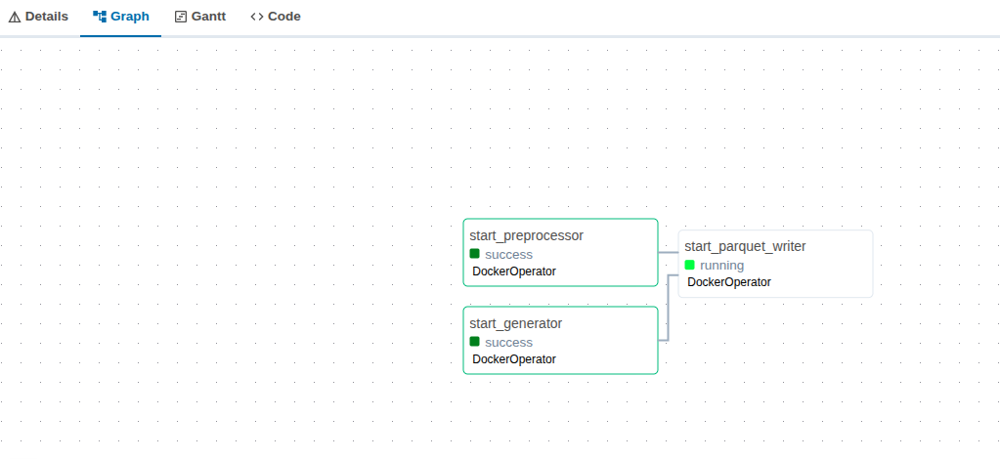
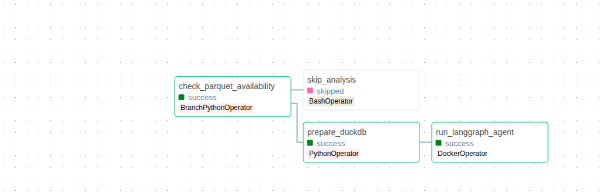
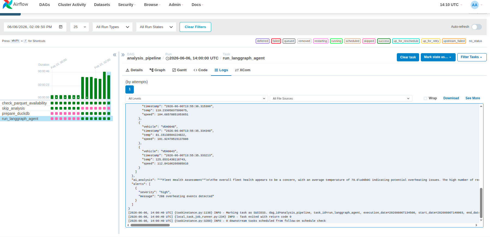
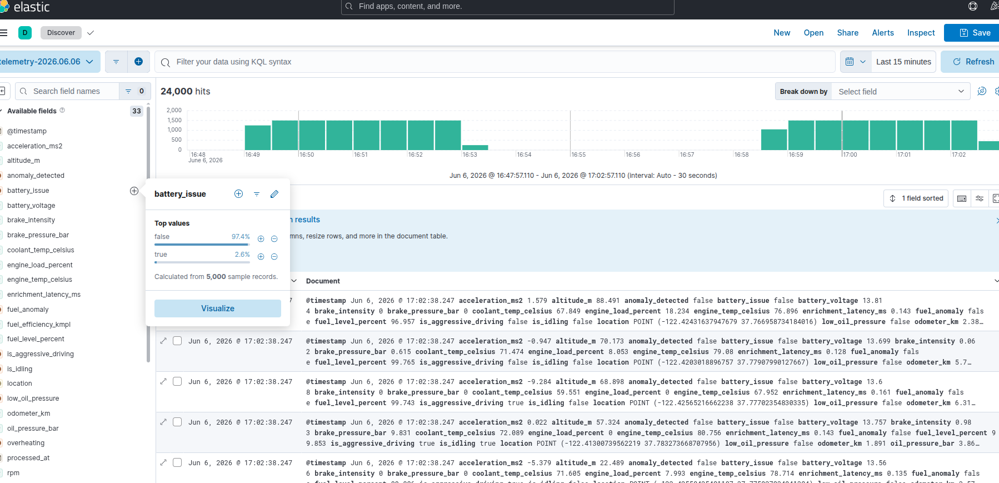
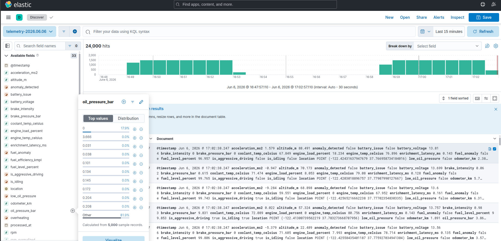

# Car Sensor Telemetry Analytics System

A containerized telemetry pipeline that generates, streams, processes, and analyzes car sensor data using Apache Kafka, Apache Airflow, Parquet storage, AI-powered analysis with LangGraph/Ollama, and Elasticsearch/Kibana for visualization.

## System Overview

The pipeline simulates a real-world automotive telemetry stack end-to-end:

1. **Data generation** — 50 simulated vehicles producing realistic sensor readings (speed, RPM, temperatures, fuel, etc.) with synthetic anomaly injection
2. **Streaming** — Kafka decouples producers from consumers with two topics: `car-telemetry-raw` and `car-telemetry-enriched`
3. **Preprocessing** — real-time enrichment adds derived metrics, anomaly flags, and normalization via Redis-backed vehicle state
4. **Storage** — Hive-partitioned Parquet files for efficient analytical queries
5. **Orchestration** — Airflow schedules both pipelines and manages dependencies
6. **AI analysis** — LangGraph multi-agent system queries DuckDB and uses llama3.2 for anomaly detection, root cause analysis, and trend forecasting
7. **Visualization** — Elasticsearch indexes enriched events; Kibana provides dashboards and geo maps

## Architecture

```
                    Apache Airflow Orchestration
               Telemetry Pipeline (5 min) | Analysis Pipeline (15 min)
                           |                        |
                           v                        v
         Generator -> Kafka (raw) -> Preprocessor -> Kafka (enriched)
                                                          |
                                          ┌───────────────┘
                                          |
                              ┌───────────┴───────────┐
                              v                       v
                        Parquet Writer           ES Writer
                              |                       |
                              v                       v
                           DuckDB             Elasticsearch
                              |                       |
                              v                       v
                        LangGraph AI               Kibana
                        (llama3.2)             Dashboards
```

## Screenshots

### Telemetry pipeline DAG

Generator and preprocessor run in parallel (both `DockerOperator`), then fan-in to trigger the parquet writer once both succeed.



### Analysis pipeline DAG

`check_parquet_availability` is a `BranchPythonOperator` — if no data is ready it routes to `skip_analysis`, otherwise it loads DuckDB and runs the LangGraph agent as a `DockerOperator`.



### LangGraph agent output in Airflow logs

The agent produces a structured fleet health report. In this run it flagged 288 overheating events across the fleet with severity `high`, and reported an average engine temperature of 79.6°C.



### Kibana — exploring indexed telemetry

Enriched messages land in daily indices (`telemetry-YYYY.MM.DD`) with 33 mapped fields. The Discover view shows 24,000 documents indexed over a 15-minute window.

Field stats for `battery_issue` show the anomaly injection rate working as expected — 97.4% normal, 2.6% flagged:



`oil_pressure_bar` distribution across the same sample:



## Prerequisites

- Docker and Docker Compose v2.0+
- 8 GB RAM minimum (16 GB recommended when running Ollama)
- 20 GB free disk space
- Linux or macOS (Windows with WSL2 works too)

## Quick Start

The easiest way to get everything running is the deploy script:

```bash
./deploy.sh
```

It handles building all images, starting services in the right order, initializing Airflow, and pulling the Ollama model.

### Manual setup

If you prefer to do it step by step:

```bash
# 1. environment
echo "AIRFLOW_UID=$(id -u)" > .env.local
cat .env.local >> .env
mkdir -p dags logs plugins data/{parquet,analysis_results,archive,duckdb}

# 2. build images
docker build -t custom-airflow:latest airflow-custom
docker build -t generator:latest services/generator
docker build -t preprocessor:latest services/preprocessor
docker build -t parquet-writer:latest services/parquet_writer
docker build -t langgraph-agent:latest services/langgraph_agent
docker build -t elasticsearch-writer:latest services/elasticsearch_writer

# 3. start infrastructure
docker compose up -d zookeeper kafka kafka-ui redis postgres-airflow ollama elasticsearch kibana elasticsearch-writer
# wait ~90s for health checks to pass

# 4. init and start Airflow
docker compose up airflow-init
docker compose up -d airflow-webserver airflow-scheduler

# 5. pull llama3.2 (~2 GB, one-time)
docker compose --profile init up ollama-init
```

### Access

| Service | URL | Credentials |
|---|---|---|
| Airflow | http://localhost:8081 | admin / admin |
| Kafka UI | http://localhost:8080 | — |
| Kibana | http://localhost:5601 | — |
| Elasticsearch | http://localhost:9200 | — |
| Ollama API | http://localhost:11435 | — |

Once everything is up, enable `telemetry_pipeline` and `analysis_pipeline` in the Airflow UI.

## Services

### Generator (`services/generator/`)

Produces realistic car sensor data to `car-telemetry-raw`. Simulates 50 vehicles with different driving modes (urban, highway, aggressive, eco, parked) and injects anomalies at ~8% probability. Uses OpenTelemetry for trace propagation.

### Preprocessor (`services/preprocessor/`)

Consumes from `car-telemetry-raw`, enriches each message with:
- derived metrics: acceleration, engine load, brake intensity
- rule-based anomaly flags: overheating, low oil pressure, battery issues
- normalized sensor values (0–1 scale)
- Redis-backed per-vehicle state for acceleration calculation

Publishes enriched messages to `car-telemetry-enriched`.

### Parquet Writer (`services/parquet_writer/`)

Consumes from `car-telemetry-enriched` and writes to Hive-partitioned Parquet files under `data/parquet/year=.../month=.../day=.../hour=.../`. Batches 1000 records per file with SNAPPY compression.

### Elasticsearch Writer (`services/elasticsearch_writer/`)

Consumes from `car-telemetry-enriched` and bulk-indexes into daily Elasticsearch indices (`telemetry-YYYY.MM.DD`). Flattens nested fields and maps `location` as a `geo_point` for Kibana Maps. 33 fields are mapped including all sensor readings, anomaly flags, and derived metrics.

### LangGraph Agent (`services/langgraph_agent/`)

Reads from DuckDB (loaded from Parquet) and runs a multi-agent LangGraph pipeline using llama3.2 via Ollama. Produces structured JSON reports with fleet-level health assessments, per-vehicle anomaly alerts, and trend analysis. Reports are saved to `data/analysis_results/`.

## Airflow DAGs

**`telemetry_pipeline`** — runs every 5 minutes

`start_generator` and `start_preprocessor` run in parallel as `DockerOperator` tasks, both fanning into `start_parquet_writer` which starts only after both succeed.

**`analysis_pipeline`** — runs every 15 minutes

`check_parquet_availability` (`BranchPythonOperator`) decides the path: if no data is ready it skips to `skip_analysis` (a no-op `BashOperator`), otherwise it runs `prepare_duckdb` (`PythonOperator`) then `run_langgraph_agent` (`DockerOperator`).

## Data schema

### Raw telemetry (`car-telemetry-raw`)

```json
{
  "vehicle_id": "VEH0001",
  "timestamp": "2026-02-15T10:30:00Z",
  "sensor_data": {
    "speed_kmh": 65.5,
    "rpm": 2500,
    "engine_temp_celsius": 90.0,
    "fuel_level_percent": 75.0,
    "battery_voltage": 13.8
  },
  "location": { "latitude": 37.7749, "longitude": -122.4194 }
}
```

### Enriched telemetry (`car-telemetry-enriched`)

Adds `derived_metrics`, `anomaly_flags`, `normalization`, and `processing_metadata` on top of the raw schema.

## Configuration

Key variables in `.env`:

```bash
GENERATOR_NUM_VEHICLES=50
GENERATOR_ANOMALY_PROBABILITY=0.08
PARQUET_MAX_BATCH_SIZE=10000
OLLAMA_MODEL=llama3.2
```

## Troubleshooting

**Airflow tasks fail with "Cannot connect to Docker daemon"**
```bash
ls -la /var/run/docker.sock
sudo usermod -aG docker $USER && newgrp docker
```

**Ollama model not found**
```bash
docker compose exec ollama ollama pull llama3.2
```

**Elasticsearch writer keeps restarting**

Check that the client version is pinned correctly in `services/elasticsearch_writer/requirements.txt`:
```
elasticsearch>=8.12.0,<9.0.0
```
The v9 client sends an incompatible Accept header against ES 8.x. Rebuild if you changed the pin:
```bash
docker compose build elasticsearch-writer && docker compose up -d elasticsearch-writer
```

**Out of disk space**
```bash
rm -rf data/parquet/year=*
docker compose down -v
```

## Monitoring

```bash
# service status
docker compose ps

# follow logs
docker compose logs -f airflow-scheduler
docker compose logs -f elasticsearch-writer

# check Kafka topics
docker compose exec kafka kafka-topics --list --bootstrap-server localhost:9092

# trigger a DAG manually
docker compose exec airflow-webserver airflow dags trigger telemetry_pipeline
```

## Tech stack

- **Orchestration**: Apache Airflow 2.8.1
- **Streaming**: Apache Kafka 7.5.0 (Confluent) + Zookeeper
- **Storage**: Parquet (PyArrow), DuckDB
- **Visualization**: Elasticsearch 8.12, Kibana 8.12
- **AI/ML**: LangChain, LangGraph, Ollama llama3.2
- **Data processing**: Polars, NumPy, SciPy
- **State**: Redis
- **Tracing**: OpenTelemetry
- **Runtime**: Docker Compose

## Resources

- [Apache Airflow docs](https://airflow.apache.org/docs/)
- [Apache Kafka quickstart](https://kafka.apache.org/quickstart)
- [LangGraph docs](https://langchain-ai.github.io/langgraph/)
- [Elasticsearch Python client](https://www.elastic.co/guide/en/elasticsearch/client/python-api/current/index.html)
- [Ollama model library](https://ollama.com/library)

## Cleanup

```bash
docker compose down       # stop services, keep volumes
docker compose down -v    # stop and delete all volumes (data loss)
rm -rf data logs
```

---

Built with ❤️ for learning MLOps, streaming architectures, and AI-powered analytics
